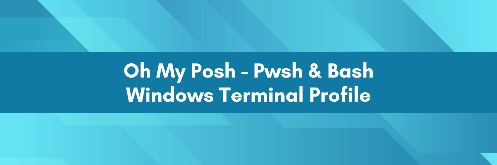

# Oh-My-Posh :: Overview :: Mk3


## Release Notes
> **MAY 2024** \
> Rebuilt PowerShell Functions \
> Added Support for AKS Clusters \
> Move PowerShell Modules back to User Documents \
> Rebuilt WSL/Liunx bash script

## Improvements Over Mk2
Since the release of the Mk2 Profile back in August 2023, I've learnt and realised that the PowerShell modules don't need to be installed directly in the `C:\Program Files\WindowsPowerShell\Modules` folder to get cross platform/version support.
Having completed a lot of testing with some virtual machines. \
I worked out that you can use the `C:\Users\%UserName%\Documents\PowerShell\Modules` or `C:\Users\%UserName%\Documents\WindowsPowerShell\Modules` and by creating symbolic links between the two folder paths, you can import modules across both PowerShell versions. - neat right! 🧐

While doing some research as well around other peoples `$PROFILE` setups, I came across a couple of interesting links.

[Chris Titus Tech - Pretty PowerShell](https://github.com/ChrisTitusTech/powershell-profile) \
[Scott Hanselman - My Ultimate PowerShell Prompt](https://www.hanselman.com/blog/my-ultimate-powershell-prompt-with-oh-my-posh-and-the-windows-terminal) \
[Scott Hanselman - Customizing you Powershell prompt with PSReadLine ](https://www.hanselman.com/blog/you-should-be-customizing-your-powershell-prompt-with-psreadline) \
[Anit Jha - Elevate your Windows PowerShell](https://blog.anit.dev/elevate-your-windows-powershell-my-personal-customization-guide)

## Modules and Applications Overview
### PowerShell Modules
 - [PackageManagement](https://www.powershellgallery.com/packages/PackageManagement)
 - [PowerShellGet](https://www.powershellgallery.com/packages/PowerShellGet)
 - [PSReadLine](https://www.powershellgallery.com/packages/PSReadLine)
 - [Pester](https://www.powershellgallery.com/packages/Pester)
 - [Posh-Git](https://www.powershellgallery.com/packages/posh-git)
 - [Terminal-Icons](https://www.powershellgallery.com/packages/Terminal-Icons)
 - [Az](https://www.powershellgallery.com/packages/Az)

### Winget Modules
 - [JanDeDobbeleer.OhMyPosh](https://winstall.app/apps/JanDeDobbeleer.OhMyPosh)
 - [Git.Git](https://winstall.app/apps/Git.Git)
 - [Github.Cli](https://winstall.app/apps/GitHub.cli)
 - [Microsoft.AzureCLI](https://winstall.app/apps/Microsoft.AzureCLI)
 - [Microsoft.Azure.Kubelogin](https://winstall.app/apps/Microsoft.Azure.Kubelogin)
 - [Kubernetes.kubectl](https://winstall.app/apps/Kubernetes.kubectl)
 - [Helm.Helm](https://winstall.app/apps/Helm.Helm)
 - [Ookla.Speedtest.CLI](https://winstall.app/apps/Ookla.Speedtest.CLI)

## Windows Terminal Nerd Font 
Nerd Fonts patches developer targeted fonts with a high number of glyphs (icons). Specifically to add a high number of extra glyphs from popular ‘iconic fonts’
You can get yours here: [Nerd Font](https://www.nerdfonts.com/font-downloads)

Using the `New-OhMyPoshProfile.ps1` it will auto install the `Cascadia Code` Font. \
The font file which is installed is the: `CaskaydiaCoveNerdFont-Regular.ttf` \
If you want to add this support to Visual Studio Code, you can update the Font Family:

```
Consolas, 'Courier New', 'CaskaydiaCove Nerd Font'
```

## Pre Device Setup

> [!IMPORTANT]
> If you've used the v2 setup, You'll manually need to remove Modules from \
> pwsh7 :: C:\Program Files\PowerShell\Modules \
> pwsh5 :: C:\Program Files\WindowsPowerShell\Modules

### Powershell 5 default modules

``` powershell
Directory: C:\Program Files\WindowsPowerShell\Modules

Mode                 LastWriteTime         Length Name
----                 -------------         ------ ----
d-----        07/05/2022     06:42                Microsoft.PowerShell.Operation.Validation
d-----        07/05/2022     06:42                PackageManagement
d-----        07/05/2022     06:42                Pester
d-----        07/05/2022     06:42                PowerShellGet
d-----        07/05/2022     06:42                PSReadLine
```

## Device Setup

### -> Windows

<details>
<summary> New Device Setup </summary>
Ensure that you can execute scripts on your local machine

``` powershell
Set-ExecutionPolicy -Scope 'CurrentUser' -ExecutionPolicy 'RemoteSigned'
```

Download and execute the New-PSProfile.ps1 script.

``` powershell
$setupUrl = 'https://raw.githubusercontent.com/smoonlee/oh-my-posh-profile/feature/main/New-OhMyPoshProfile.ps1'
Invoke-WebRequest -Uri $setupUrl -OutFile $Pwd\New-OhMyPoshProfile.ps1
.\New-OhMyPoshProfile.ps1
```
</details>

### -> Linux
<details>
<summary> New Device Setup </summary>

``` bash
setupUrl=''https://raw.githubusercontent.com/smoonlee/oh-my-posh-profile/feature/main/New-OhMyPoshProfile.sh'
curl -s $setupUrl -o $HOME/New-OhMyPoshProfile.sh | sudo bash New-OhMyPoshProfile.sh
```

</details>

<details>
<summary> WSL :: Kubernetes </summary>

> [!NOTE]
> Since Mk3, This is built into the setup script!

You might need to create the `.kube` folder first
``` bash
mkdir $HOME/.kube
```

Then create a symbolic link to the Windows `.kube` folder
> [!NOTE]
> Please update the Users folder to match your Windows User folder

``` bash
ln -sf /mnt/c/Users/<username>/.kube/config $HOME/.kube/config
```
</details>